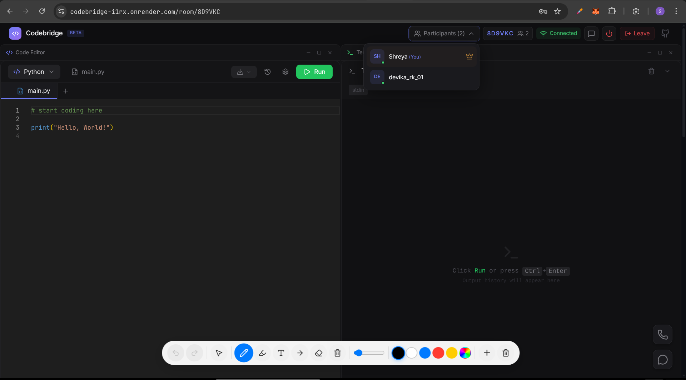
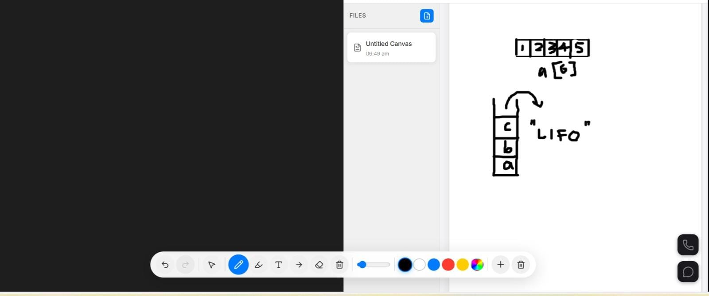
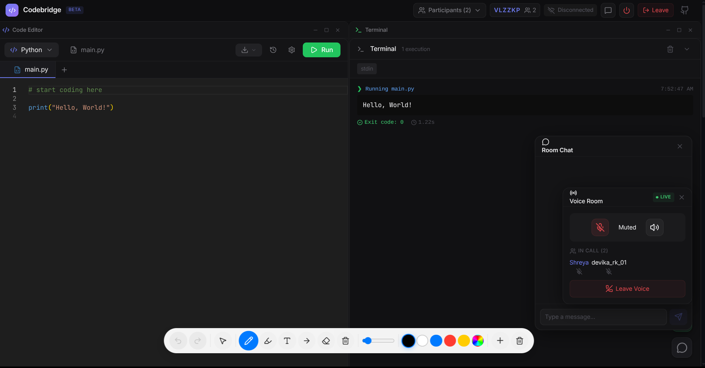
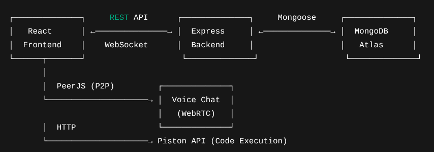
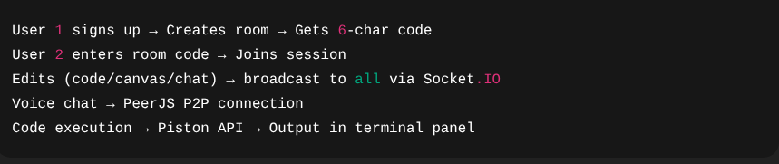

<p align="center">
  
</p>

# CodeBridge 

## Basic Details

**Team Name:** HerStack 

**Team Members:**
- Member 1: Shreya Padmakumar - NSS College of Engineering
- Member 2: Devika R K - NSS College of Engineering

**Hosted Project Link:** [https://codebridge.onrender.com](https://codebridge-i1rx.onrender.com)

**Project Description:**  
CodeBridge is a browser-based collaborative coding platform that lets multiple users write code, draw on a shared canvas, chat, and talk — all in real-time. Think Google Docs, but for developers.

**Problem Statement:**  
Remote pair programming and team coding sessions require juggling between VS Code Live Share, Discord, Excalidraw, and shared terminals, making collaboration fragmented and inefficient.

**Solution:**  
CodeBridge integrates code editing, a whiteboard, voice chat, text chat, and code execution into a single platform, with real-time updates powered by WebSockets and P2P voice via PeerJS.

---

## Technical Details

**Languages:** JavaScript  
**Frameworks:** React 19, Express.js, Vite  
**Libraries:** Socket.IO, Monaco Editor, Fabric.js, PeerJS, Mongoose, JWT, jsPDF, html2canvas, Tailwind CSS  
**Tools:** VS Code, Git, Docker, MongoDB Atlas, Render  

---

## Features

- **Live code editing** — synchronized edits in real-time  
- **Shared canvas** — drawing tools, shapes, text, dark mode, PDF export  
- **Voice chat** — P2P audio with mute/unmute  
- **Text chat** — instant messaging within the session  
- **Code execution** — supports multiple languages via Piston API  
- **Download options** — export workspace as ZIP or PDF  

---

## Implementation

### Installation

```bash
# Frontend
npm install

# Backend
cd server
npm install
```
### Run
```bash
# Frontend
npm run dev

# Backend
cd server
npm run dev
```

### Docker Setup
```bash
docker compose up --build
```

---
## Project Documentation

#### Screenshots



Users run code in Docker containers and everyone sees the output instantly.



Users draw together on a shared whiteboard.



Users talk to each other using peer-to-peer voice connections along with messages that appear instantly for everyone in the room..

**System Architecture:**



This shows the system architecture

**Application Workflow:**



This workflow demonstrates how users collaborate in real-time, with all actions synchronized across the session.

---

## Additional Documentation

### For Web Projects with Backend:

#### API Documentation:

**Base URL:** `https://codebridge-backend-fal8.onrender.com`

##### Endpoints:
### API Endpoints

#### Auth Endpoints

**POST /api/auth/signup**
- **Description:** Create a new user account
- **Request Body:**
```json
{
  "username": "yourusername",
  "email": "youremail@example.com",
  "password": "yourpassword"
}
```
- **Response:**
```json
{
  "message": "Account created successfully",
  "user": { "username": "yourusername", "email": "youremail@example.com" },
  "token": "your-jwt-token"
}
```
**POST /api/auth/login**
- **Description:** Login to account
- **Request Body:**
```json
{
  "email": "youremail@example.com",
  "password": "yourpassword"
}
```
- **Response:**
```json
{
  "message": "Login successful",
  "user": { "username": "yourusername", "email": "youremail@example.com" },
  "token": "your-jwt-token"
}
```
**GET /api/auth/me**
- **Description:** Get current user info
- **Response:**
```json
{
  "username": "yourusername",
  "email": "youremail@example.com"
}
```
**POST /api/auth/logout**
- **Description:** Logout and update online status
- **Response:**
```json
{
   "message": "Logout successful"
}
```
#### Room Endpoints

**POST /api/rooms**
- **Description:** Create a new collaboration room
- **Response:**
```json
{
  "message": "Room created",
  "room": { "roomId": "A3BX9K", "name": "My Project Room" }
}
```

**POST /api/rooms/:roomId/join**
- **Description:** Join an existing room by room code
- **Response:**
```json
{
  "message": "Joined room successfully",
  "roomId": "A3BX9K"
}
```
**GET /api/rooms/:roomId/state**
- **Description:** Get full room state (code files, canvas, chat history)
- **Response:**
```json
{
  "files": [],
  "canvas": {},
  "chat": []
}
```

**DELETE /api/rooms/:roomId**
- **Description:** Delete a room (host only)
- **Response:**
```json
{
  "Room deleted successfully"
}
```

## Project Demo

### Video Link: 
https://drive.google.com/drive/folders/1ASj8tfHkaRLd0l-HmCj9-NGMTnq9NqSY

## Team Contributions

- Shreya Padmakumar: Managed Docker orchestration, container networking and backend 
- Devika R K: Frontend & UI/UX
---

## License

This project is licensed under the MIT License - see the [LICENSE](LICENSE) file for details.


---

Made with ❤️ at TinkerHub
